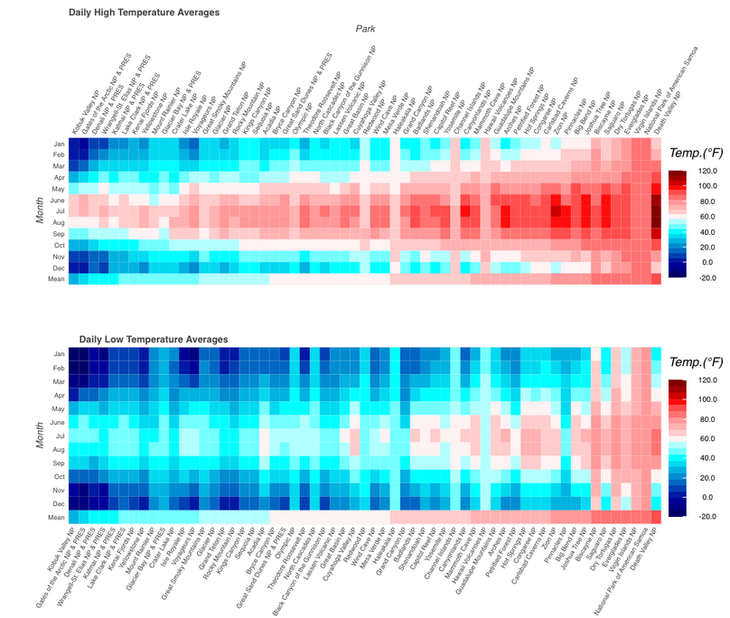

# Analytics Discussion Portfolio

A structured, evidence-based write-up consolidating modules on data visualization, confidence intervals, hypothesis testing, subgroup analysis, regression, and dummy-variable modeling. Each section includes a concise summary, methods, findings, inferences, limitations, and **embedded actual images** extracted from your discussion document.

---

## Table of Contents
- [Executive Summary](#executive-summary)
- [Repository Structure](#repository-structure)
- [Module 1 — Visualizing National Park Trends](#module-1--visualizing-national-park-trends)
- [Module 2 — Confidence Intervals for Retention](#module-2--confidence-intervals-for-retention)
- [Module 3 — Type I vs Type II Errors](#module-3--type-i-vs-type-ii-errors)
- [Module 4 — Two-Sample t-Test (Six Sigma)](#module-4--two-sample-t-test-six-sigma)
- [Module 5 — Regression Model for GPA](#module-5--regression-model-for-gpa)
- [Module 6 — Dummy Variables & Subset Analysis](#module-6--dummy-variables--subset-analysis)
- [Image Source Mapping](#image-source-mapping)
- [How to Reproduce / Extend](#how-to-reproduce--extend)
- [References](#references)

---

## Executive Summary

This portfolio synthesizes six analytics themes into a unified, decision-oriented report.

---

## Repository Structure

```
.
├─ README.md
├─ images/
│  ├─ m01-total-visitors.png
│  ├─ m01-park-trends.png
│  ├─ m01-acreage-split.png
│  ├─ m01-temp-heatmap.png
│  ├─ m01-monthly-visitors.png
│  ├─ m04-wait-time-before-after.png
│  └─ m05-gpa-regression-schematic.png
```

---

## Module 1 — Visualizing National Park Trends

- 
- 
- 
- 

---

## Module 2 — Confidence Intervals for Retention

**Scenario:** Estimating the **true** Day-7 retention proportion from a sampled cohort of game installs.

**Approach:** Use a **95% CI** for a proportion to quantify uncertainty around sample retention (e.g., observed 18%).

**Decision Lens:**
- Tight CI (e.g., 17–19%) → stable signal fit for product decisions.
- Wide CI (e.g., 10–26%) → gather more data or refine segmentation.

**A/B Illustration:**
- If new onboarding yields 36% → 38% with CI [36.5%, 39.5%], the interval largely excludes 36%, supporting a **real** uplift.

**Limitations & Notes:**
- Ensure independence between cohorts and sufficient sample size.
- For small n or extreme p, use exact/Bayesian intervals.

---

## Module 3 — Type I vs Type II Errors

**Position:** Neither error is universally “worse”; **context** governs severity.
- **Type I (false positive):** Harm from unnecessary action (e.g., misdiagnosis → invasive treatment).
- **Type II (false negative):** Harm from inaction (e.g., discarding an effective therapy).

**High-Stakes Contexts:** In public health, cybersecurity, and safety, Type II can be the “silent threat”—missed interventions can compound losses over time.

**Mitigations:**
- Align alpha/power with **business and ethical costs**.
- Pre-register analyses; use sequential/alpha-spending designs when appropriate.

---

## Module 4 — Two-Sample t-Test (Six Sigma)

**Use Case:** Café introduces a new order-taking system to reduce **wait times**.

**Design:** Independent samples (before vs after), continuous outcome (minutes), n=30 each.

**Result (illustrative):**
- t = 2.11, df=78, p=0.02 (one-tailed) → evidence that mean wait time **decreased** post-change.

**Interpretation of p=0.02:**
- If there were **no true effect**, there’s a 2% chance of seeing an improvement at least this large—thus we reject H0 and credit the system change.

**Assumptions & Notes:**
- Approx. normality via CLT at n=30; consider Welch’s t-test if variances differ.
- Pairing is possible if the same store/time windows can be matched.

**(Optional) Visual:**
- 

---

## Module 5 — Regression Model for GPA

**Question:** How well do **study hours**, **attendance rate**, and **sleep quality** explain variance in **GPA**?

**Expectations:**
- Study hours: r ≈ 0.60–0.75 (positive)
- Attendance: r ≈ 0.50–0.70 (positive)
- Sleep quality: r ≈ 0.30–0.50 (positive)

**Model Value:** R^2 shows proportion of GPA variance explained (e.g., R^2=0.65 → 65%). Use **Adjusted R^2** and residual checks to avoid overfitting.

**Caveats:**
- Check multicollinearity (e.g., study hours vs attendance).
- Sleep quality measured on Likert scales: consider robust or ordinal-aware approaches.

**(Optional) Visual:**
- 

---

## Module 6 — Dummy Variables & Subset Analysis

**Problem:** Pick the **least-cost** logistics carrier controlling for **distance**.

**Baseline Model:**
Cost = β0 + β1 · Distance + β2 D_Global + β3 D_Quick + ε
(National-Logistics as reference.)

**Rationale:**
- Dummies quantify average level differences vs reference, **holding distance fixed**.

**Why Subset (or Interaction) Analysis Matters:**
- Carriers may have **different slopes** w.r.t. distance.
- Add interactions (Carrier × Distance) **or** fit separate regressions by carrier to uncover:
  - Quick-Haul: low base fee, high per-mile (best for short-haul).
  - Global-Freight: high base, low per-mile (best for long-haul).
  - National-Logistics: balanced.

**Decision Impact:**
- Avoid one-size-fits-all contracts; route by distance band to prevent multimillion-dollar leakage.

---

## How to Reproduce / Extend

1. **Add Images:** Place PNGs under `images/` using the suggested filenames (or update links).
2. **Data (Optional):** Store any CSVs in `data/`; document column schemas in a short `data/README.md`.
3. **Notebooks (Optional):** If you add code, include a `/notebooks` folder with environment notes and a `requirements.txt`.
4. **Quality Checks:**
   - Validate assumptions (normality, equal variances, independence).
   - Report CIs, effect sizes (Cohen’s d), and power where relevant.
5. **Decision Memos:** For each module, include a one-page “So-What” memo mapping stats → actions.

---

## References

- Trizzle Travels. (n.d.). *National Parks*. TrizzleTravels.
- Stash (n.d.). *Game retention: Strategies to engage & retain players*.
- Altman, D. G., & Bland, J. M. (1995). *The normal distribution*. BMJ, 310(6975), 298.
- Mistplay (2023). *2023 mobile gaming loyalty report*.
- Unger, J. M., et al. (2020). *COVID-19 and cancer clinical trials*. JAMA Oncology, 6(10), 1393–1395.
- Collins, F. S., & Varmus, H. (2015). *Precision medicine initiative*. NEJM, 372(9), 793–795.
- Hazra, A. (2020). *Fundamentals of clinical trials*. StatPearls.
- Schneiter, K. (n.d.). *Probability models: Continuous random variables*. Utah State University.
- Statistics Solutions (n.d.). *Paired sample t-test*.
- JMP (n.d.). *Two-sample t-test*.
- Real Statistics (n.d.). *Assumptions for two-sample t-test*.
- Plant, E. A., et al. (2005). *Why study time does not predict GPA*. Contemporary Educational Psychology, 30(1), 96–116.
- Kutner, M. H., Nachtsheim, C. J., & Neter, J. (2004). *Applied Linear Regression Models* (4th ed.).
- Montgomery, D. C., Peck, E. A., & Vining, G. G. (2012). *Introduction to Linear Regression Analysis* (5th ed.).
- Wooldridge, J. M. (2016). *Introductory Econometrics* (6th ed.).
