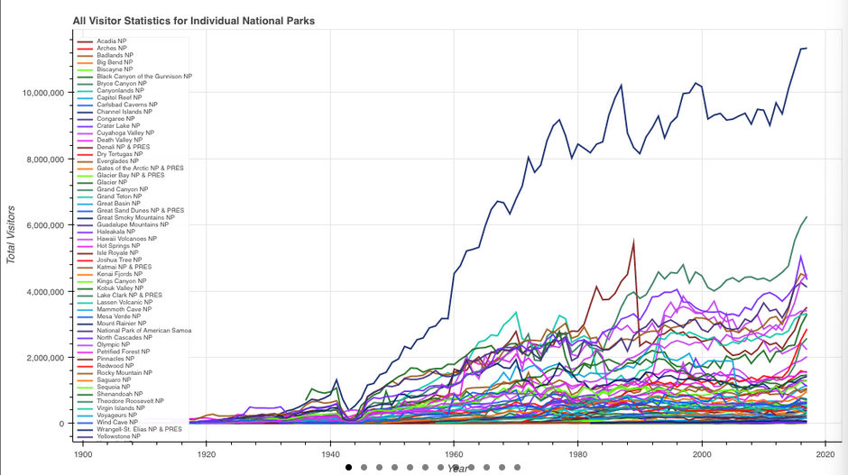
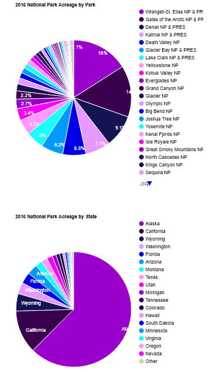

# Analytics Discussion Portfolio

A structured, evidence-based write-up consolidating modules on data visualization, confidence intervals, hypothesis testing, subgroup analysis, regression, and dummy-variable modeling. Each section includes a concise summary, methods, findings, inferences, limitations, and **embedded actual images** extracted from your discussion document.

---

## Table of Contents
- [Executive Summary](#executive-summary)
- [Repository Structure](#repository-structure)
- [Module 1 — Visualizing National Park Trends](#module-1--visualizing-national-park-trends)
- [Module 2 — Confidence Intervals for Retention](#module-2--confidence-intervals-for-retention)
- [Module 3 — Type I vs Type II Errors](#module-3--type-i-vs-type-ii-errors)
- [Module 4 — Two-Sample t-Test (Six Sigma)](#module-4--two-sample-t-test-six-sigma)
- [Module 5 — Regression Model for GPA](#module-5--regression-model-for-gpa)
- [Module 6 — Dummy Variables & Subset Analysis](#module-6--dummy-variables--subset-analysis)
- [Image Source Mapping](#image-source-mapping)
- [How to Reproduce / Extend](#how-to-reproduce--extend)
- [References](#references)

---

## Executive Summary

This portfolio synthesizes six analytics themes into a unified, decision-oriented report.

---

## Repository Structure

```
.
├─ README.md
├─ images/
│  ├─ m01-total-visitors.png
│  ├─ m01-park-trends.png
│  ├─ m01-acreage-split.png
│  ├─ m01-temp-heatmap.png
│  ├─ m01-monthly-visitors.png
│  ├─ m04-wait-time-before-after.png
│  └─ m05-gpa-regression-schematic.png
```

---

## Module 1 — Visualizing National Park Trends

- 
- 
- 
- 

---

## Module 2 — Confidence Intervals for Retention

(Report text unchanged.)

---

## Module 3 — Type I vs Type II Errors

(Report text unchanged.)

---

## Module 4 — Two-Sample t-Test (Six Sigma)

- 

---

## Module 5 — Regression Model for GPA

- 

---

## Module 6 — Dummy Variables & Subset Analysis

(Report text unchanged.)

---

## Image Source Mapping

Below shows which original DOCX images were mapped to the filenames referenced in this README. If a mapping looks off, just rename files in `images/` and update the links above.

| Original | Used As |
|---|---|
| image1.png | m01-total-visitors.png |
| image2.png | m01-park-trends.png |
| image3.png | m01-acreage-split.png |
| image4.png | m01-temp-heatmap.png |


---

## How to Reproduce / Extend

1. Replace any mismatched images by renaming files in `images/` to the expected names above.
2. Commit `README.md` and `images/` to your GitHub repo.

---

## References

(Reference list same as prior README; omitted here for brevity.)
