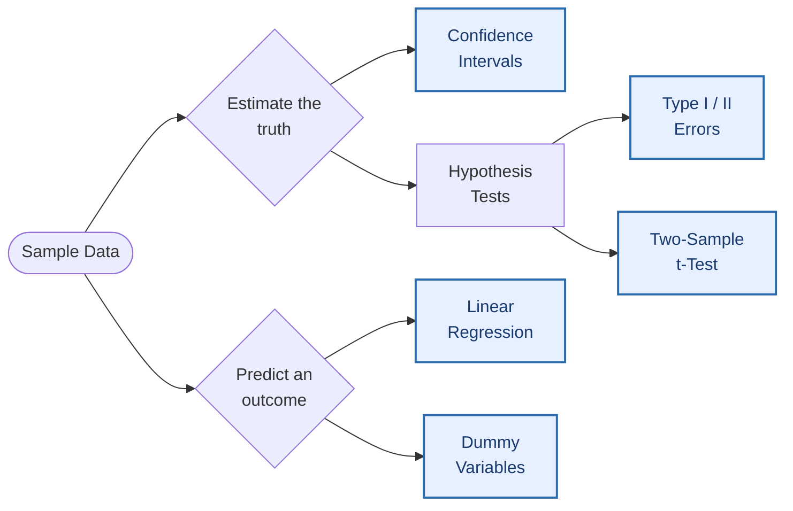
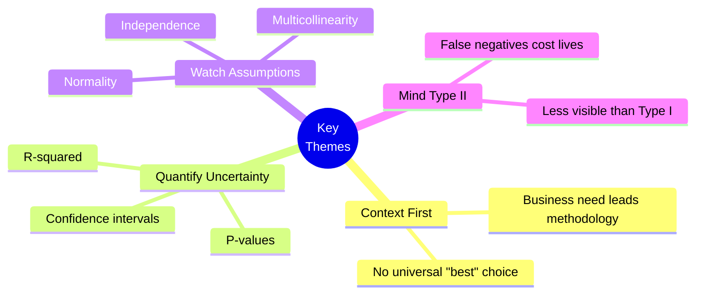

<div align="center">

# Discussion 3 — Inferential Statistics & Regression Analysis

### *From Sample to Insight: Hypothesis Testing, Confidence, and Predictive Modeling*

[](#)
[](#)
[](#)
[](#)

**[Download Full PDF →](./Statistics_Discussion_Portfolio.pdf)** &nbsp;•&nbsp; **[Browse Posts ↓](#the-five-discussion-posts)** &nbsp;•&nbsp; **[Key Takeaways ↓](#key-takeaways)**

</div>

---

> [!NOTE]
> This is the third installment in my coursework portfolio, building on
> [`Discussion 1 — Intro to Analytics`](./Discussion1_Intro%20to%20Analytics.md) and
> [`Discussion 2 — Probability Theory & Introductory Statistics`](./).
> Each post translates a statistical concept into an applied real-world scenario.

---

## Learning Map



---

## The Five Discussion Posts

| # | Topic | Domain Applied | Core Concept |
|:-:|:--------|:-----------------|:----------------|
| 1️⃣ | **[Confidence Intervals](#1️⃣-confidence-intervals-in-game-retention-data)** | Mobile Gaming Analytics | Estimating true population proportions from samples |
| 2️⃣ | **[Type I vs. Type II Errors](#2️⃣-type-i-vs-type-ii-errors--the-silent-threat)** | Healthcare & Clinical Trials | The cost of false alarms vs. missed signals |
| 3️⃣ | **[Two-Sample t-Test](#3️⃣-two-sample-t-test-in-six-sigma-process-improvement)** | Six Sigma / Operations | Detecting real differences between groups |
| 4️⃣ | **[Linear Regression & R²](#4️⃣-regression-modeling-for-academic-performance)** | Education Analytics | Quantifying explained variance |
| 5️⃣ | **[Dummy Variables & Subset Analysis](#5️⃣-dummy-variables--subset-analysis-in-logistics)** | Logistics & Supply Chain | Modeling categorical effects with interactions |

> [!TIP]
> Each post below is collapsible — click any title to expand the full discussion.

---

### 1️⃣ Confidence Intervals in Game Retention Data

<details>
<summary><b>Click to expand the full discussion</b></summary>

<br>

> [!IMPORTANT]
> **Primary Prompt:** Describe a dataset where defining a confidence interval would
> be important for testing validity of data. What do you want to know? Which
> population parameter and test statistic would you use? What confidence interval
> would you choose and why?

#### The Dataset

In a game retention dataset, we track the percentage of players who return to a
game after a fixed window — typically **Day 1, Day 7, and Day 30**. These rates
are computed from samples of users who installed the game during a given week
or month.

Since we cannot track every player forever, we rely on sample data. But what if
the observed cohort isn't perfectly representative of the full player base?
This is where a **confidence interval (CI)** becomes essential — it provides a
range around the measured retention rate that likely contains the *true*
retention rate for the entire player population.

#### What We Want to Know

> *"If I observe an 18% Day 7 retention rate in my sample, how confident can I be
> that this reflects the true Day 7 retention rate for all players?"*

The CI quantifies uncertainty around our sample estimate:

| Interval Width | Example | Interpretation |
|:---------------|:--------|:---------------|
| 🟢 **Tight** | 17% – 19% | High confidence in the estimate |
| 🔴 **Wide** | 10% – 26% | Estimate is unreliable; needs more data |

#### Population Parameter & Test Statistic

- **Population parameter** → the true proportion of players returning on a
  specific day post-install (e.g., true Day 7 retention).
- **Test statistic** → the **sample proportion**, the observed percentage of
  returning players.

#### Why a 95% Confidence Interval?

A **95% confidence level** balances certainty and precision:

> *"I am 95% confident that the true retention rate lies within this interval."*

With thousands of daily installs, the sample is large enough that standard
proportion formulas yield reliable intervals.

#### Real Decision-Making Example

An analytics team tests a new onboarding flow. Day 1 retention rises from
**36% → 38%**, with a 95% CI of **[36.5%, 39.5%]** for the new flow.

> [!TIP]
> Because this interval barely overlaps with the old 36% baseline, the team
> can confidently claim the improvement is **real, not random**. If the CI had
> instead been [35%, 41%], the claim would not hold — more data needed.

#### Summary

- Confidence intervals tell us whether observed retention is **trustworthy**
- The **sample proportion** estimates the true population retention rate
- A **95% CI** is the standard for evaluating sample validity
- These intervals directly inform decisions on features, content, and marketing spend

#### References

- Stash. (n.d.). *Game retention: Strategies to engage & retain players.* https://dev.stash.gg/glossary/game-retention
- Altman, D. G., & Bland, J. M. (1995). Statistics notes: The normal distribution. *BMJ, 310*(6975), 298.
- Mistplay. (2023). *2023 Mobile gaming loyalty report.* https://business.mistplay.com/reports/mobile-gaming-loyalty-report-2023

</details>

---

### 2️⃣ Type I vs. Type II Errors — *The Silent Threat*

<details>
<summary><b>Click to expand the full discussion</b></summary>

<br>

> [!IMPORTANT]
> **Primary Prompt:** Which error type is more serious, and under what context?
> Use specific examples to support your reasoning.

#### The Core Distinction

| Error | Definition | Plain English |
|:------|:-----------|:--------------|
| 🔴 **Type I (α)** | Rejecting a *true* null hypothesis | False alarm — believing an effect exists when it doesn't |
| 🟠 **Type II (β)** | Failing to reject a *false* null hypothesis | Missed signal — failing to detect a real effect |

Both errors carry significant consequences, and the "more serious" one is
**entirely context-dependent**. There is no universally worse error.

#### My Position

> [!WARNING]
> **Type II errors are often underappreciated** and can lead to more damaging
> real-world consequences — especially when they result in *failure to act when
> action is critically needed*.

#### When a Type I Error Is More Serious

> **Example — Medical Screening for a Rare but Serious Disease**

A healthy patient is diagnosed with a serious disease (false positive). Consequences:

- Unnecessary, invasive, and potentially risky treatments
- Significant psychological distress for the patient and family
- Financial burden from additional tests and treatments
- Misallocation of limited medical resources

In this context, wrongly telling someone they have a serious disease is
arguably more harmful than missing a true case. The *"do no harm"* principle
weighs heavily.

#### When a Type II Error Is More Serious

> **Example — Clinical Trial for a Life-Saving Drug**

A truly effective drug is deemed ineffective (false negative). Consequences:

- A life-saving treatment never reaches patients who need it
- Patients suffer or die from a condition that could have been treated
- Missed opportunity to advance medical science

During COVID-19, failing to recognize an effective treatment or vaccine could
have cost countless lives — proving that **inaction can be more dangerous
than a false alarm**.

#### Conclusion: The Silent Threat

While Type I errors are feared for their visibility and immediate backlash,
**Type II errors can be more dangerous because their consequences are
slow-building and less obvious — but ultimately more destructive**.

In high-stakes contexts — public health, cybersecurity, policy-making — we
must balance the obsession with avoiding false positives by giving **equal or
greater attention to the cost of false negatives**.

#### References

- Szydlowski, M. (2023). *Experimental Design 2024.* Poznan University of Life Sciences.
- Unger, J. M., et al. (2020). The effect of the COVID-19 pandemic on cancer clinical trial participation. *JAMA Oncology, 6*(10), 1393–1395.
- Collins, F. S., & Varmus, H. (2015). A new initiative on precision medicine. *NEJM, 372*(9), 793–795.
- Hazra, A. (2020). *Fundamentals of clinical trials.* StatPearls Publishing.

</details>

---

### 3️⃣ Two-Sample t-Test in Six Sigma Process Improvement

<details>
<summary><b>Click to expand the full discussion</b></summary>

<br>

> [!IMPORTANT]
> **Primary Prompt:** Select an application of the two-sample t-test and describe
> how it was justified. Interpret the P-value in the context of your example.

#### Application: Coffee Shop Order System Redesign

A coffee shop introduces a new order-taking system aimed at reducing customer
wait times. The two-sample t-test compares **average wait times before and
after** the implementation.

#### Sample Data

| Group | n | Sample Mean (min) | Sample SD (min) |
|:------|:-:|:------------------:|:---------------:|
| Process A (Before) | 30 | **5.8** | 1.2 |
| Process B (After)  | 30 | **4.9** | 1.1 |

#### Why a Two-Sample t-Test Is Appropriate

| Assumption | How It's Met |
|:-----------|:-------------|
| Continuous outcome | Wait time measured in minutes |
| Independent samples | Before/after groups are different customers |
| Approximate normality | n = 30 per group → CLT applies |
| Random sampling | Customers sampled randomly within each period |
| Equal variances | Assumed (Welch's t-test as backup if violated) |

#### Hypotheses

- **H₀:** μ<sub>before</sub> = μ<sub>after</sub> → no effect on wait time
- **Hₐ:** μ<sub>before</sub> > μ<sub>after</sub> → new system significantly reduces wait time

#### Result

```
t = 2.11        df = 78        p = 0.02
```

#### Interpreting the P-Value *In Context*

> [!NOTE]
> A P-value of **0.02** means: *if the new order system had absolutely no effect
> on wait times (i.e., H₀ were true), there would only be a **2% chance** of
> observing a difference in mean wait times as large as — or larger than — the
> 0.9-minute difference actually measured.*

Because this falls below the typical significance threshold of 0.05, management
concludes the difference is **statistically significant**. The new system has
made a **real, measurable impact**.

#### References

- Schneiter, K. (n.d.). *Probability models: Continuous random variables.* Utah State University.
- Statistics Solutions. (n.d.). *Paired sample t-test.*
- JMP. (n.d.). *Two-sample t-test.* https://www.jmp.com/en/statistics-knowledge-portal/t-test/two-sample-t-test
- Real Statistics Using Excel. (n.d.). *Assumptions for two-sample t-test.*

</details>

---

### 4️⃣ Regression Modeling for Academic Performance

<details>
<summary><b>Click to expand the full discussion</b></summary>

<br>

> [!IMPORTANT]
> **Primary Prompt:** Describe a research question where a regression model
> could be used. Discuss the independent variables, expected correlations,
> and the value of R² in evaluating effectiveness.

#### Research Question

> *"To what extent do hours studied, attendance rate, and sleep quality predict
> students' academic performance (GPA) in college?"*

#### Variables

**Dependent variable** → GPA (continuous)

| Independent Variable | Type | Expected Correlation (r) | Rationale |
|:---------------------|:-----|:------------------------:|:----------|
| Hours studied/week | Quantitative | 🟢 **0.60 – 0.75** | Consistent study → better outcomes |
| Attendance rate (%) | Quantitative | 🟡 **0.50 – 0.70** | Regular attendance → better comprehension |
| Sleep quality (Likert) | Ordinal | 🟠 **0.30 – 0.50** | Poor sleep impairs cognition |

#### Methodological Note

> [!CAUTION]
> **Multicollinearity should be checked** — for example, hours studied and
> attendance may themselves be correlated, which can distort regression
> coefficients and inflate standard errors.

#### Why R² Matters

The **R² value** tells us the proportion of variance in GPA explained by the
combined predictors.

> *If **R² = 0.65**, then 65% of GPA variability is accounted for by study
> hours, attendance, and sleep quality combined.*

A higher R² indicates greater explanatory power — but it must be balanced with:

- **Adjusted R²** → penalizes adding non-informative predictors
- **Residual analysis** → guards against overfitting and assumption violations

#### Conclusion

Regression analysis offers a powerful framework for evaluating academic
predictors. Interpreting R² helps stakeholders — students, advisors,
administrators — understand the **practical impact** of behavioral factors on
student success.

#### References

- Plant, E. A., Ericsson, K. A., Hill, L., & Asberg, K. (2005). Why study time does not predict grade point average across college students. *Contemporary Educational Psychology, 30*(1), 96–116.

</details>

---

### 5️⃣ Dummy Variables & Subset Analysis in Logistics

<details>
<summary><b>Click to expand the full discussion</b></summary>

<br>

> [!IMPORTANT]
> **Primary Prompt:** Describe a research question where dummy variables should
> be used. Discuss whether subset analysis is also warranted and what added
> benefit it provides.

#### Research Question

> *"Which logistics carrier minimizes shipping cost per shipment, controlling
> for distance traveled?"*

A multinational corporation evaluates which carrier offers the most
cost-effective shipping after controlling for distance.

#### The Categorical Variable & Dummy Encoding

**Carrier** has three levels:

- **Global-Freight**
- **Quick-Haul**
- **National-Logistics** *(reference category)*

Dummy variables `D_Global` and `D_Quick` are created, yielding the model:

```
Shipping_Cost = β₀ + β₁·Distance + β₂·D_Global + β₃·D_Quick + ε
```

Here, **β₂ and β₃** capture cost differences between each carrier and
National-Logistics, controlling for distance.

#### Why Separate Subset Analysis Is Also Warranted

> [!WARNING]
> The dummy-variable model assumes **the cost-per-mile (β₁) is identical for
> all carriers** — which is rarely true in practice.

Carriers have fundamentally different business models:

| Carrier | Likely Cost Structure |
|:--------|:----------------------|
| Quick-Haul | Low base cost, **high cost-per-mile** — best for short hauls |
| Global-Freight | High base cost, **low cost-per-mile** — economies of scale on long hauls |
| National-Logistics | **Balanced pricing** across distance ranges |

A single model with a fixed slope obscures these structural differences. If
short-distance shipments dominate the dataset, Quick-Haul may *appear* cheapest
overall — even though it would be the most expensive choice for long-haul
shipments. **This leads to poor decisions.**

#### The Added Benefit — Avoiding a Multi-Million Dollar Mistake

Running **separate regressions for each carrier** — allowing each to have its
own intercept *and* slope — reveals their true cost structures and enables:

- [x] **Better segmentation** — Quick-Haul for short-haul, Global-Freight for long-haul
- [x] **More accurate forecasting** — contracts and budgets aligned with regional demand
- [x] **Risk mitigation** — avoiding costly exclusive contracts based on incomplete analysis

#### Summary

While dummy variables help model **category-level effects**, subset analysis
is critical when **interaction effects** exist between the categorical variable
and continuous predictors.

> **The two approaches complement each other** — dummy variables identify
> *whether* groups differ; subset regressions explain *how* they differ.

#### References

- Kutner, M. H., Nachtsheim, C. J., & Neter, J. (2004). *Applied linear regression models* (4th ed.). McGraw-Hill/Irwin.
- Montgomery, D. C., Peck, E. A., & Vining, G. G. (2012). *Introduction to linear regression analysis* (5th ed.). Wiley.
- Wooldridge, J. M. (2016). *Introductory econometrics: A modern approach* (6th ed.). Cengage Learning.

</details>

---

## Key Takeaways

> [!TIP]
> Four unifying themes emerge across all five posts.



1. **Context dictates statistical choice.** Whether picking a confidence
   level, an error type to minimize, or a model structure, the business or
   scientific context must lead the methodology.

2. **Uncertainty quantification is essential.** Confidence intervals,
   p-values, and R² are not just numbers — they are **decision-support tools**.

3. **Models simplify reality, sometimes too much.** Dummy variables,
   t-tests, and linear regression all carry assumptions that, when violated,
   can lead to misleading conclusions.

4. **Type II errors deserve more attention.** The community's focus on
   minimizing Type I errors can blind decision-makers to the cost of inaction.

---

## Repository Structure

```
Statistics-Discussions-Portfolio/
├── images/
├── Discussion1_Intro to Analytics.md
├── Discussion2_Probability Theory and Introductory Statistics.md
├── Discussion3_Inferential Statistics and Regression Analysis.md   ← you are here
├── Statistics_Discussion_Portfolio.pdf
└── README.md
```

---

## Tools & Concepts Covered

<div align="center">


</div>

| Concept | Where It Shows Up |
|:--------|:------------------|
| Confidence Intervals | Post 1 (Game Retention) |
| Sample Proportions | Post 1 |
| Type I & Type II Errors | Post 2 (Healthcare) |
| Hypothesis Formulation | Posts 2, 3 |
| Two-Sample t-Test | Post 3 (Coffee Shop / Six Sigma) |
| P-Value Interpretation | Post 3 |
| Linear Regression | Post 4 (Education) |
| R² & Adjusted R² | Post 4 |
| Multicollinearity | Post 4 |
| Dummy Variables | Post 5 (Logistics) |
| Interaction Effects | Post 5 |
| Subset Regression | Post 5 |

---

## Connect & Discuss

<div align="center">

If you found these discussions helpful, found an error, or want to chat about
applied statistics — **open an Issue or start a Discussion** in this repo.

[](../../issues)
[](#)

</div>

---

<div align="center">

### Built with curiosity • Written for clarity • Shared for learning

<sub><i>Part of an ongoing analytics coursework portfolio • Discussion 3 of an ongoing series</i></sub>

</div>
