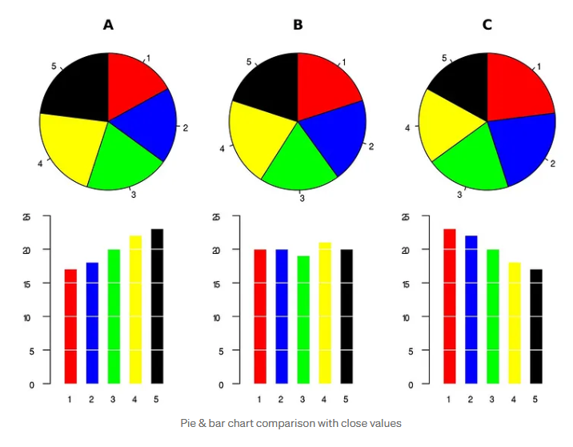
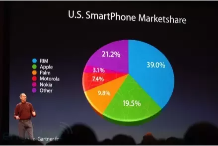
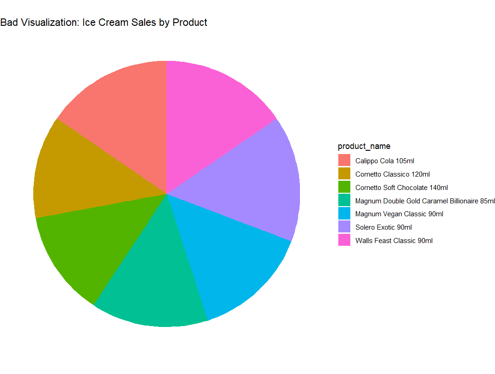
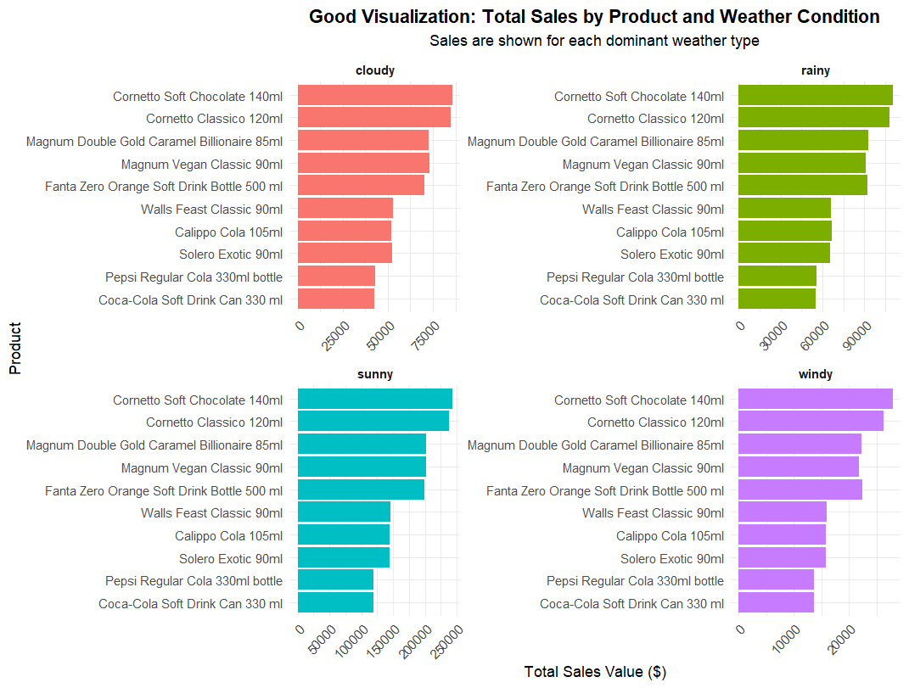
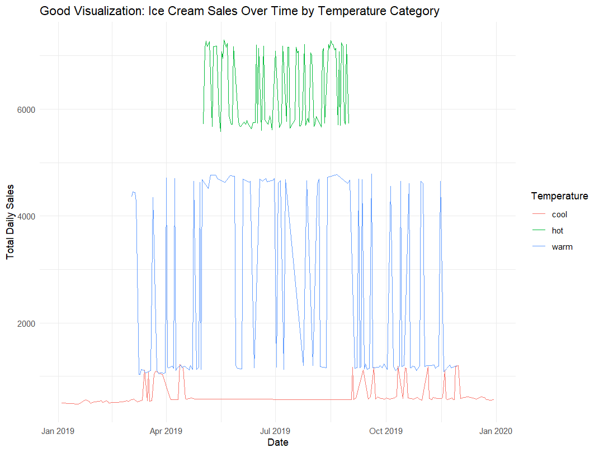
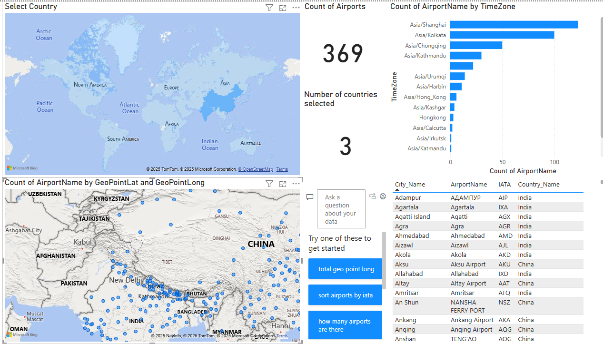
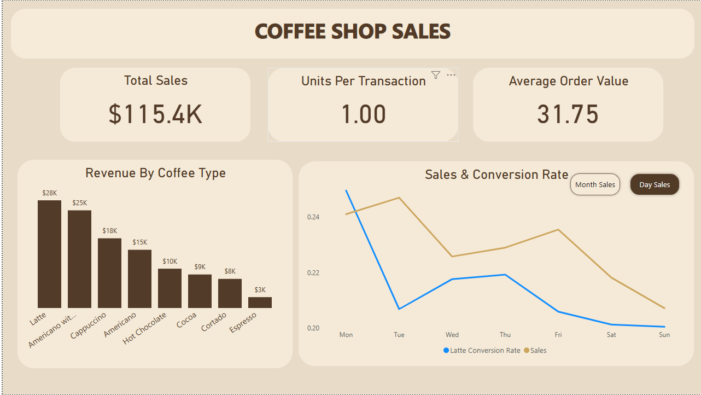

# Data Visualization & Storytelling

   

This file consolidates a set of **course discussion posts** on **communicating with data** — when a chart
helps, when it misleads, how to ask the right questions before building one, and how dashboards turn
numbers into decisions. It pairs a critique of pie charts with good-vs-bad visualization practice and two
**Power BI** storytelling dashboards.

> Why this write-up?
> - Turn scattered visualization discussions into one cohesive artifact.
> - Preserve every original figure with context.
> - Capture the *reasoning* behind good chart choices, not just the charts.

## Table of Contents
- [Overview](#overview)
- [Module 1 — Save the Pies for Dessert](#module-1--save-the-pies-for-dessert)
- [Module 2 — Ethical & Appropriate Data Visualizations](#module-2--ethical--appropriate-data-visualizations)
  - [Good vs. Bad Visualization (Ice Cream Sales)](#good-vs-bad-visualization-ice-cream-sales)
- [Module 3 — Storytelling with Dashboards (Airports)](#module-3--storytelling-with-dashboards-airports)
- [Module 4 — Calculated Fields (Coffee Shop KPIs)](#module-4--calculated-fields-coffee-shop-kpis)
- [Data](#data)
- [Key Takeaways](#key-takeaways)
- [Reproducibility & Tools](#reproducibility--tools)
- [References](#references)
- [License](#license)

## Overview
Charts exist to summarize quantifiable information in a way that is easy to interpret. When they succeed,
they accelerate decisions; when they fail — through distortion, clutter, or poor perceptual encoding —
they mislead. These discussions work through both sides: a skeptical look at the pie chart, an ethics-first
framework for what to ask *before* visualizing, and two dashboards that put storytelling into practice.

## Module 1 — Save the Pies for Dessert

Pie charts make it easy to *misinterpret* data. As Panhalkar (2018) notes, Apple's market share of **19.5%**
can be made to look larger than a competitor's **21.2%** purely through slice framing. Because a chart's
job is to communicate quantities clearly, the pie tends to break down once it carries more than about two
categories — becoming cluttered and hard to decode.

**Key reasons to avoid (or use sparingly):**
- Difficulty in perception (judging angles/areas is hard)
- Information distortion
- Inefficiency and clutter
- Color overload
- Poor for comparison

**The counter-argument (steelman).** The criticism is often exaggerated and inconsistent: people also
misjudge *lengths* in bar charts, especially without a clear baseline — so much of the problem is human
perception, not pie charts specifically. Many tests used to discredit pies don't match their intended job:
showing **part-to-whole relationships at a glance**. The chart should be chosen by **context and
communication goal**, not by popular opinion.

> *"Pie charts are not without value, but that value is rarely worth the cost."* — Stephen Few (2007)

**Figure 1.** Pie vs. bar comparison with close values — three sets (A/B/C) where the pie makes near-equal
categories hard to rank, while the bar chart resolves them instantly.

**Figure 2.** The classic U.S. smartphone market-share pie — an example where slice framing can distort
perceived rank.

## Module 2 — Ethical & Appropriate Data Visualizations

**Industry context: FinTech — cross-border digital payments.** In companies handling international
transactions (e.g., Wise, Revolut, Stripe), data drives regulatory compliance, fraud detection, user
experience, and market strategy. A product-analytics / BI analyst works alongside product managers,
compliance officers, and engineers, where the recurring tension is **compliance vs. user experience** —
users want seamless onboarding and real-time transfers, while compliance must enforce KYC/AML controls.

**Two questions I would ask to define data needs:**
1. **What regulatory/compliance requirements shape how we visualize and share customer data?** — ensures
   visuals respect privacy, honor data-masking rules, and avoid interpretations that create compliance risk.
2. **Who is the primary audience, and what decision must they make with this?** — regulators, executives,
   and product managers each need a different level of complexity, granularity, and interactivity.

**Two questions I anticipate being asked:**
1. **Can you prove the data isn't cherry-picked or biased in presentation?** — from risk teams/auditors,
   pushing transparency in source selection and statistical representation.
2. **How does this improve conversion or retention without violating privacy?** — leadership's concern for
   *ethical optimization*: better outcomes while staying user-centric and privacy-compliant.

**Additional considerations:**
- Is the visualization **accessible and inclusive** (color-blind safe, clear labeling) for a global audience?
- Could the chart **mislead** through improper scaling or missing context?

### Good vs. Bad Visualization (Ice Cream Sales)

**Figure 3. Bad visualization — Ice cream sales by product (pie).** Seven near-equal slices with heavy color
overload; ranking products by eye is effectively impossible.

**Figure 4. Good visualization — Total sales by product and weather condition (faceted bars).** Small
multiples across *cloudy / rainy / sunny / windy* make within-condition ranking and cross-condition scale
differences immediately readable.

**Figure 5. Good visualization — Ice cream sales over time by temperature category.** Daily sales colored by
*cool / warm / hot* clearly separate the temperature bands and expose seasonality across 2019.

## Module 3 — Storytelling with Dashboards (Airports)

An early **Power BI** dashboard built for Assignment 1. The objective was operational: help a pilot or air
traffic controller quickly identify airports available across a terrain — useful for flight planning and for
siting new airports, while surfacing geographic limitations (e.g., the sparse coverage around the Himalayas
near the Tibet region). A natural extension is linking an air-scanner API for live, on-demand usage.

**Figure 6.** Airport intelligence dashboard — country selector + world map, airport counts, count of
airports by time zone, a geo-scatter of airport lat/long over the terrain, and a searchable city/IATA table.

## Module 4 — Calculated Fields (Coffee Shop KPIs)

A **Power BI** dashboard built from a mock coffee dataset, using new **measures** derived from existing data
— **Conversion Rate**, **AOV (Average Order Value)**, and **UPT (Units Per Transaction)** — to drive the KPI
cards.

**The story in the numbers:**
- **Total Sales: $115.4K** — the shop is performing well; the **Latte** is the top revenue driver (~$28K),
  followed by Americano-with-milk (~$25K) and Cappuccino (~$18K).
- **Average Order Value: $31.75** — healthy.
- **Units Per Transaction: 1.00** — customers buy exactly **one item per visit**. This is the key gap.
- Sales and Latte conversion **peak mid-week** and **drop on weekends**.

**Recommendation:** growth should focus on **increasing basket size**. A weekend *"add-a-pastry"* promotion
targets both the UPT = 1.00 ceiling and the weekend dip — lifting sales and units per transaction together.

**Figure 7.** Coffee shop sales dashboard — KPI cards (Total Sales, UPT, AOV), *Revenue by Coffee Type*, and
*Sales & Conversion Rate* by day.

## Data
- **`main_product_sales_weather_view.csv`** — daily product-level sales joined to weather (≈3,010 rows).
  Columns: `sales_date`, `GTIN`, `product_name`, `weekday_name`, `month_name`, `dominant_weather_type`,
  `dominant_temp_category`, `daily_sales_count`, `daily_sales_value`. Source dataset behind the Module 2
  good/bad ice-cream visualizations.
- **Airports dataset** — airport name, city, IATA, country, time zone, and geo-coordinates (Module 3 Power BI).
- **Mock coffee dataset** — transaction-level coffee sales used to derive Conversion Rate, AOV, and UPT
  measures (Module 4 Power BI).

## Key Takeaways
- **Match the chart to the goal.** Pies can show part-to-whole at a glance, but bars win decisively once
  categories are many or close in value.
- **Perception is the real constraint** — baselines, ordering, and encoding choices matter more than chart
  fashion.
- **Ethics before aesthetics.** Ask about compliance, audience, bias, accessibility, and misleading scales
  *before* building a visual — especially in regulated domains like FinTech.
- **Small multiples beat overloaded singles** for comparison across conditions (weather facets, temperature bands).
- **Dashboards should carry a decision**, not just data — the coffee dashboard turns "UPT = 1.00" into a
  concrete weekend add-on strategy.

## Reproducibility & Tools
- **Charts:** R (`ggplot2`) for the ice-cream good/bad figures; base-R style for the pie/bar comparison.
- **Dashboards:** Microsoft **Power BI** (maps, KPI cards, DAX measures for Conversion Rate / AOV / UPT).
- **Suggested steps:** load `main_product_sales_weather_view.csv` → clean/type-cast → facet sales by
  `dominant_weather_type` and color by `dominant_temp_category` → export figures to `images/`.

## References
- Panhalkar, S. (2018). *How and why are pie charts considered evil by data visualization experts* [Online forum post]. Quora. https://www.quora.com/How-and-why-are-pie-charts-considered-evil-by-data-visualization-experts
- Few, S. (2007, August). *Save the pies for dessert* [PDF]. Perceptual Edge. https://www.perceptualedge.com/articles/visual_business_intelligence/save_the_pies_for_dessert.pdf
- Viguier, C. (2018, March 9). *The hate of pie charts harms good data visualization … and why you should change the way you look at them* [Blog post]. Medium. https://medium.com/@clmentviguier/the-hate-of-pie-charts-harms-good-data-visualization-cc7cfed243b6
- Cairo, A. (2016). *The truthful art: Data, charts, and maps for communication.* New Riders.
- Duarte, N. (2010). *Resonate: Present visual stories that transform audiences.* Wiley.
- Evergreen, S. D. H. (2019). *Effective data visualization: The right chart for the right data* (2nd ed.). SAGE Publications.
- Harvard Business Review. (2015, May 28). *The two questions you need to ask your data analysts.*
- Harvard Business Review. (2016, May 4). *Better questions to ask your data scientists.*
- Marr, B. (2016). *Big data in practice: How 45 successful companies used big data analytics to deliver extraordinary results.* Wiley.

## License
This project is released under the **MIT License**. See `LICENSE` for details.
